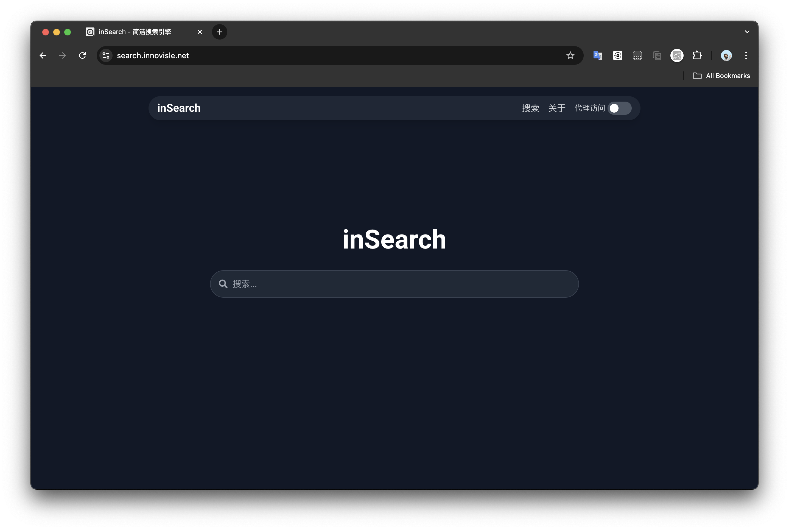

<p align="center">
  <a href="#">
    
  </a>
</p>
<h2 align="center">inSearch</h2>

inSearch 是一个旨在为无法访问 Google 的用户提供纯净搜索体验的搜索引擎。我们采用简约、扁平化的设计，确保用户在搜索时拥有高效且愉悦的体验。



## 特性

- 源自 Google，轻量搜索：使用了 Google 的（非官方）API 获取搜索结果，提供了精确又清爽的搜索结果；
- 网页代理，全面直达：提供了“网页代理”功能，即使被墙也能访问 Github、维基百科等网站;
- 系统接口，原生体验：适配了 macOS 等系统级深色模式接口，体验更沉浸。

## 技术

项目使用了 NextJS 和 Workers ，你可以轻松地在 Vercel 和 CloudFlare 测试和部署它们。

### 测试

项目采用 yarn 管理，你首先需要确保你安装了 yarn 以及其他依赖项。然后将该项目克隆到本地：

```bash
git clone https://github.com/Gloridust/in-search.git
cd ./in-search
```

然后，安装依赖项：

```bash
yarn
```

随机即可启动调试：

```bash
yarn dev
```

### 部署

1. 你可以轻松使用 [Vercel](https://vercel.com) 部署该项目的前端，开箱即用；
2. 网页代理功能需要用到 CloudFlare Workers，你需要在 [CloudFlare](https://dash.cloudflare.com/) 新建一个 Workers ，然后将 [webproxy.js](webproxy.js) 的内容粘贴进去
3. 如果你需要自己部署使用，请注意更换对应 URL 等。

## License

Apache-2.0